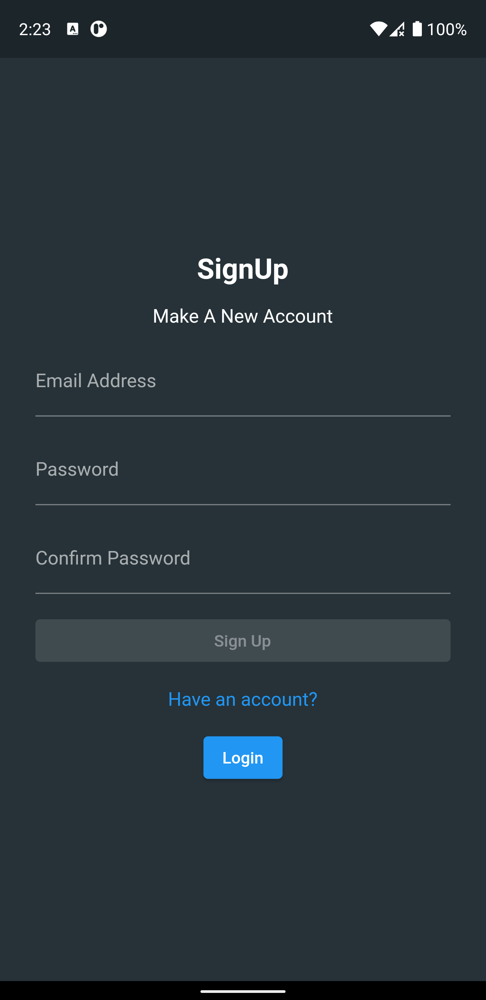
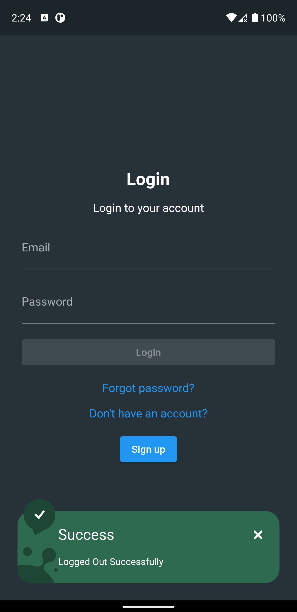
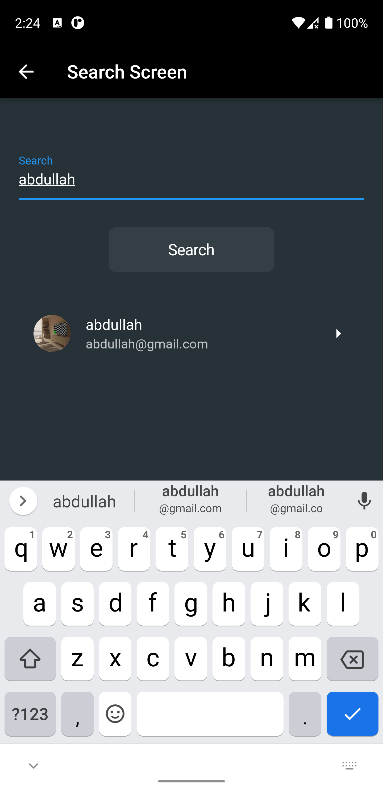
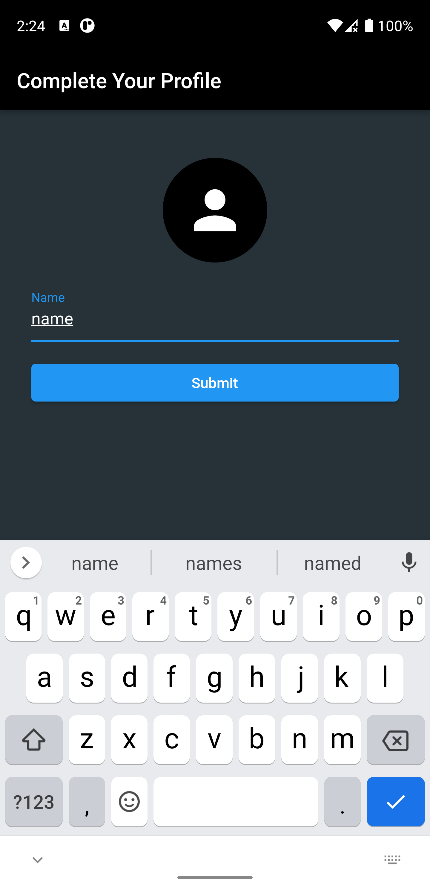
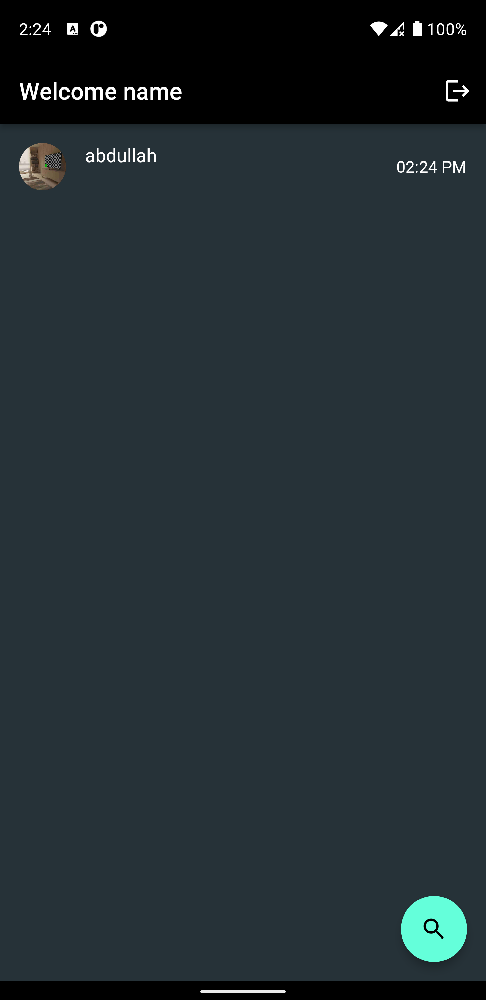
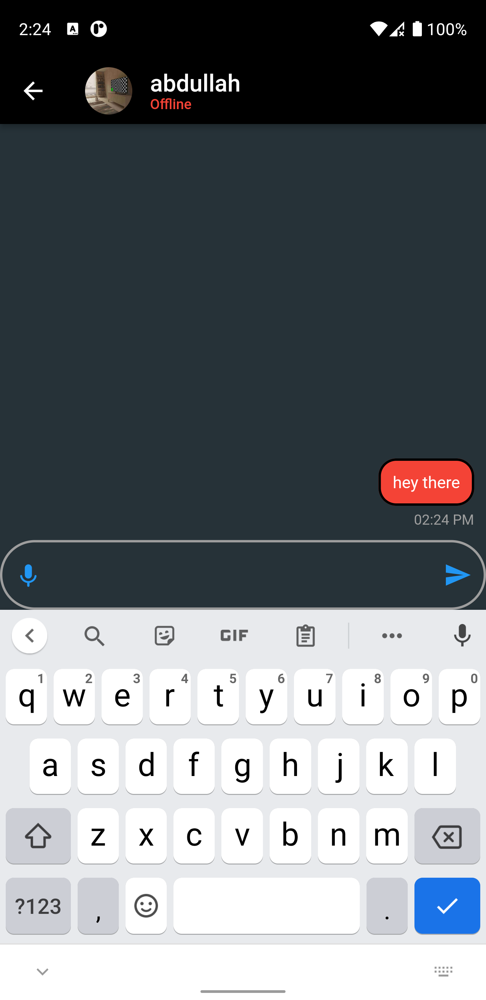

# Chat With Flutter And Firebase

`Good Sample Project For Beginners`

A full stack real time chatting app with Flutter and Firebase CRUD operaions.

## Developer:

<a href="https://github.com/Umar-Waseem">Umar Waseem</a>

## Guidelines To Contribute:

Just open a pull request if you would like to add something.
To open a pull request
- Click `fork` on the top right corner. An online copy of this repo will be made on your account.
- `Clone` the repository in you computer or just press "." button in your keyboard to open VS code Web.
- Do the changes you want to and `commit` them.
- Once you do these steps, you will see an option `"Compare & Pull Request"`, or you can just go to the parent repository and go to the pull requests section and make a pull request.
- Write about whatever changes you added.
- Wait for me to review your changes and merge the valid ones into the `master branch`.

"Something" can be:
- Code
- Comments
- Documentation
- New Features
- Issue Fixes

## Features:
- Login
- SignUp
- Sign Out
- Check Users Online/Offline status
- Chat with ANYONE registered on the app in real time
- Set profile picture while signing up
- Offline status on signout
- Online status on signup or signin

## Some sneaky features 🤪:
- Long press a message to delete it if its sent by the other user
- Type the text you want to edit with and double a text to change it, works for both reciever and sender

## Packages Used:

- cupertino_icons: ^1.0.2
- firebase_auth: ^3.7.0
- firebase_core: ^1.21.1
- cloud_firestore: ^3.4.6
- image_picker: ^0.8.5+3
- image_cropper: ^3.0.0
- firebase_storage: ^10.3.7
- awesome_snackbar_content: ^0.0.8
- uuid: ^3.0.6
- intl: ^0.17.0

## Screenshots:

